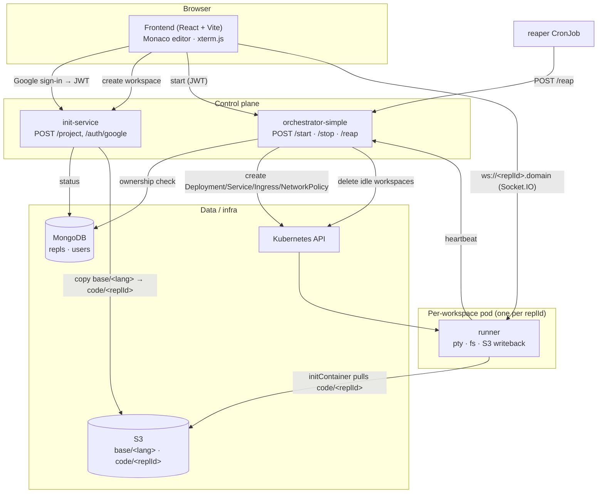
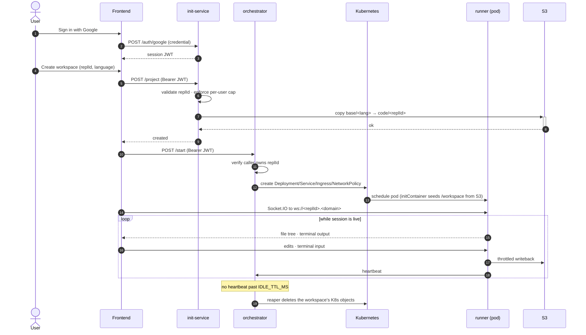

# Peppl

**A disposable, browser-based coding workspace — a repl.it clone on Kubernetes.**
Pick a workspace ID + language, get an isolated pod seeded from a template, and
edit & run code in the browser (Monaco editor + a real `bash` terminal over
Socket.IO). Sign in with Google; each user gets a capped number of ephemeral
workspaces that are reaped when idle.

[](https://github.com/KunalBharadwaj/Peppl/actions/workflows/ci.yml)

> **Demo:** _add a screenshot/GIF of the workspace here_ · _live demo link TBD_
> <!--  -->

---

## Why it's interesting

- **Pod-per-session isolation.** Every workspace is its own Kubernetes pod —
  resource-limited, non-root, all Linux capabilities dropped, filesystem access
  confined to `/workspace`, and an egress `NetworkPolicy` that blocks the cloud
  metadata endpoint and cluster-internal network so untrusted user code can't
  steal IAM credentials or move laterally.
- **Real terminal, real files.** `node-pty` gives each session an actual `bash`
  PTY; edits stream over Socket.IO and are written back to S3 (throttled +
  coalesced), so a workspace can be torn down and rehydrated.
- **Abuse-resistant control plane.** Google OAuth2 → short-lived JWT verified by
  every service with a shared secret; per-IP rate limits; a per-user cap on
  active workspaces; strict RFC1123 validation of the workspace id everywhere it
  becomes a K8s name / S3 key / Ingress host / YAML value.
- **Actually disposable.** Runners heartbeat while a session is live; a CronJob
  sweep deletes the K8s objects once a workspace goes idle past a TTL.

## Architecture

Four independent Node/TypeScript services + a React frontend, wired together by
one **`replId`** (the workspace id) and subdomain routing — *not* by direct
service-to-service RPC.



### Request lifecycle (create → code → reap)



## Services

| Service | Stack | Responsibility |
|---|---|---|
| **`frontend`** | React 18, Vite, TypeScript, Monaco, xterm.js, Socket.IO client | Landing (create a workspace) + coding page (editor, file tree, terminal). Google sign-in. |
| **`init-service`** | Express, MongoDB, AWS SDK | `POST /auth/google` (verify Google token → issue JWT), `POST /project` (validate, cap, copy S3 template, track status in Mongo). Sole writer of Mongo. |
| **`orchestrator-simple`** | Express, `@kubernetes/client-node` | `POST /start` (ownership-checked, creates the per-repl K8s objects), `DELETE /stop`, `POST /reap`, `POST /heartbeat`. Read-only view of Mongo for ownership. |
| **`runner`** | Express, Socket.IO, `node-pty`, AWS SDK | Runs *inside* each workspace pod: a `bash` PTY, `/workspace` file I/O (path-confined), S3 writeback, and a liveness heartbeat. |
| **`k8s/`** | Static manifests | Per-repl template (`orchestrator-simple/service.yaml`), the reaper CronJob, and a vendored ingress-nginx. |

`replId` is the single join key across Mongo docs, S3 key prefixes
(`code/<replId>/`), K8s object names, and the Ingress host / Socket.IO subdomain.

## Security & lifecycle design

| Concern | Approach |
|---|---|
| **Identity** | Google OAuth2 (GIS ID-token) verified server-side, exchanged for a short-lived JWT that every service checks with a shared `JWT_SECRET` — no extra cross-service call. |
| **Abuse / cost control** | Per-IP rate limits on auth + provisioning; a per-user cap (`MAX_REPLS_PER_USER`, default 5) enforced against Mongo; `/start` and `/stop` verify the caller *owns* the workspace. |
| **Injection** | `replId` is validated against `^[a-z0-9]([a-z0-9-]{0,38}[a-z0-9])?$` at every entry point before it becomes a K8s name, S3 key, Ingress host, or YAML value. |
| **Workspace sandboxing** | Non-root pod (shared UID 1000, `fsGroup`), `runAsNonRoot`, seccomp `RuntimeDefault`, `capabilities: drop [ALL]`, CPU/mem/ephemeral-storage limits, and file access confined under `/workspace` (traversal attempts rejected). |
| **Network isolation** | Egress `NetworkPolicy` allows DNS + public internet (package managers, S3) but blocks cluster-internal ranges and `169.254.169.254` (SSRF / IAM-credential theft). |
| **Disposal** | Runner heartbeats while a session has a live socket; the reaper CronJob calls `POST /reap` and the orchestrator deletes any workspace idle past `IDLE_TTL_MS`. `DELETE /stop` for explicit teardown. |

> See [`IMPROVEMENTS.md`](IMPROVEMENTS.md) for the full engineering log, including
> honest caveats (e.g. the in-memory liveness map, and cluster requirements for
> `NetworkPolicy` enforcement).

## Tech stack

**Frontend:** React 18 · Vite · TypeScript · `@monaco-editor/react` · xterm.js ·
`socket.io-client` · `@react-oauth/google`
**Backend:** Node.js · Express · TypeScript · Socket.IO · `node-pty` ·
MongoDB · AWS SDK (S3) · `@kubernetes/client-node` · `jsonwebtoken` ·
`google-auth-library` · `express-rate-limit`
**Infra:** Kubernetes (Deployment / Service / Ingress / NetworkPolicy / CronJob) ·
ingress-nginx · S3
**Testing/CI:** Vitest · `mongodb-memory-server` · GitHub Actions

## Getting started (local)

> Each service is an independent project with its own `package.json`, `tsconfig`,
> and `.env` — there is **no** root workspace tooling. `cd` into a service before
> running its scripts. You'll need Node ≥ 20, a MongoDB, an S3-compatible store,
> and (for provisioning) a reachable Kubernetes context.

**1. Copy and fill the env files** (`.env.example` lives in each service; the
frontend's is at the frontend root):

| Service | Key env vars |
|---|---|
| `init-service` | `MONGODB_URI`, `MONGODB_DB_NAME` (default `repl`), `S3_BUCKET`, `AWS_ACCESS_KEY_ID`, `AWS_SECRET_ACCESS_KEY`, `S3_ENDPOINT`, `GOOGLE_CLIENT_ID`, `JWT_SECRET`, `JWT_EXPIRES_IN` (default `7d`), `MAX_REPLS_PER_USER` (default `5`) |
| `orchestrator-simple` | `JWT_SECRET` (**must match** init-service), `MONGODB_URI` + `MONGODB_DB_NAME` (read-only ownership), `IDLE_TTL_MS` (default `1800000`), `INTERNAL_TOKEN`, plus an active kubeconfig context |
| `runner` | `S3_BUCKET`, AWS creds, `S3_ENDPOINT`, `ORCHESTRATOR_URL`, `HEARTBEAT_INTERVAL_MS` (default `30000`), `INTERNAL_TOKEN` (match orchestrator), optional `RUNNER_AUTH_TOKEN`, `MAX_FILE_BYTES`, `S3_THROTTLE_MS`, `CORS_ORIGIN` |
| `frontend` | `VITE_CONTROL_PLANE_URL` (default `http://localhost:3001`), `VITE_ORCHESTRATOR_URL` (default `http://localhost:3002`), `VITE_GOOGLE_CLIENT_ID`, `VITE_OUTPUT_BASE_DOMAIN` |

**2. Run the control plane** (each in its own terminal):

```bash
# init-service  → :3001
cd good-code/init-service     && yarn install && yarn dev

# orchestrator  → :3002   (needs a working kubeconfig context)
cd good-code/orchestrator-simple && yarn install && yarn dev

# frontend      → :5173
cd good-code/frontend         && npm install && npm run dev
```

The `runner` runs *inside* the workspace pod (image `100xdevs/runner`), not on
your host — it's built and pushed as a container and pulled by the Deployment the
orchestrator creates.

**3. Provision the reaper** (optional, in-cluster): create a `peppl-internal`
Secret with key `internal-token` matching `INTERNAL_TOKEN`, then
`kubectl apply -f good-code/k8s/reaper-cronjob.yaml`.

## Testing

Per service (`good-code/<service>/`):

```bash
yarn build   # tsc -b — typed build of src/
yarn test    # vitest run
```

- **Unit tests** cover the pure, security-critical logic: patch application,
  `/workspace` path confinement, `replId` validation, and the reaper's idle math.
- **Integration test** (`init-service`) runs the repl repository against an
  ephemeral MongoDB (`mongodb-memory-server`) — real indexes, the unique
  constraint, and ownership-scoped retry logic. It skips (doesn't fail) if mongod
  can't start locally; CI runs it for real.
- **CI** (`.github/workflows/ci.yml`) runs install + build + test for the three
  backend services and install + lint + build for the frontend on every push and PR.

## Repository layout

```
good-code/
├── frontend/             # React + Vite SPA (landing + coding page)
├── init-service/         # auth + project creation (Mongo + S3)
├── orchestrator-simple/  # K8s provisioning + lifecycle (start/stop/reap)
├── runner/               # in-pod: pty + fs + S3 writeback + heartbeat
└── k8s/                  # per-repl template, reaper CronJob, ingress-nginx
```

## Roadmap

See [`IMPROVEMENTS.md`](IMPROVEMENTS.md). Done: auth + rate limiting, workspace
security hardening, idle reaping/lifecycle, tests + CI. Next: health/readiness
probes + structured logging, Dockerfiles + `docker-compose` for the whole plane,
and moving the remaining hardcoded workspace domain into config.
